# SnowTower 🏔️

<div align="center">

[](https://github.com/Database-Tycoon/snowtower/actions/workflows/merge-deploy.yml)
[](https://github.com/Database-Tycoon/snowtower/actions/workflows/pr-validation.yml)
[](https://www.python.org/downloads/)
[](https://docs.astral.sh/uv/)
[](https://opensource.org/licenses/MIT)

</div>

## 🚀 User Access Guide - Getting Your Snowflake Access

**Need Snowflake access?** Follow these steps:

### Step 1: Generate Your RSA Keys FIRST
Before requesting access, you MUST generate your RSA key pair:

```bash
# Generate RSA key pair (run this on your local machine)
openssl genrsa 2048 | openssl pkcs8 -topk8 -inform PEM -nocrypt -out ~/.ssh/snowflake_rsa_key.p8
openssl rsa -in ~/.ssh/snowflake_rsa_key.p8 -pubout -out ~/.ssh/snowflake_rsa_key.pub

# Secure your private key
chmod 400 ~/.ssh/snowflake_rsa_key.p8

# Display your PUBLIC key (you'll need to copy this)
cat ~/.ssh/snowflake_rsa_key.pub
```

**⚠️ IMPORTANT**: Keep your PRIVATE key (`~/.ssh/snowflake_rsa_key.p8`) secure and NEVER share it!

### Step 2: Request Access with Your Public Key
Now create a GitHub issue with your public key:
- 📝 **[Request Access Form →](../../issues/new/choose)** - Fill out the form
- **PASTE YOUR PUBLIC KEY** in the required field
- Your account will be created with RSA authentication ready
- Standard requests are approved within 3-5 business days

### Step 3: Connect to Snowflake (After Approval)
Configure your Snowflake client with your credentials:

```bash
# Using SnowSQL
snow connection add \
  --connection-name prod \
  --account YOUR_ACCOUNT \
  --user YOUR_USERNAME \
  --private-key-path ~/.ssh/snowflake_rsa_key.p8 \
  --role YOUR_ROLE

# Test your connection
snow sql -c prod -q "SELECT CURRENT_USER(), CURRENT_ROLE()"
```

### Step 4: Your Authentication Methods

Once your account is created, you'll have TWO ways to authenticate:

1. **RSA Key Authentication** (Primary)
   - Uses the private key you generated (`~/.ssh/snowflake_rsa_key.p8`)
   - Most secure method
   - Recommended for daily use

2. **Password Authentication** (For Web UI Only)
   - Auto-generated secure password (provided by IT via secure channel)
   - **📌 IMPORTANT: Use this password ONLY for the Snowflake Web UI**
   - **🔐 For CLI, scripts, and applications: Always use RSA key authentication**
   - Managed entirely by IT/administrators - reach out to IT to get your auto-generated password
   - Contact admin for password resets - you cannot change it yourself
   - This separation enhances security by limiting password exposure

**That's it!** You now have secure access to Snowflake with dual authentication methods. 🎉

### What to Expect After Login

When you first connect to Snowflake, here's what you'll have access to:

**🎭 Your Default Role**
- New users typically start with a technical role based on your team
- This grants basic read access to shared data
- Additional roles can be requested based on your business needs

**🗄️ Your Development Database**
- You'll have your own personal development database: `DEV_YOURNAME`
- Full control to create schemas, tables, and views
- Perfect for testing and experimentation without affecting production

**🖥️ Default Warehouse**
- Usually `MAIN_WAREHOUSE` for general use
- Auto-suspends after 60 seconds of inactivity to save costs
- X-Small size by default (can be adjusted based on workload)

**📊 Available Data**
- Read access to production databases like `PROJ_STRIPE`, `SOURCE_STRIPE`
- Access to shared schemas based on your role assignments
- Your own `DEV_` database for personal work

**Example First Session:**
```sql
-- After logging in, you'll see something like:
-- Current role: SNOWTOWER_USERS__T_ROLE
-- Current warehouse: MAIN_WAREHOUSE
-- Current database: (none selected)

-- Check what you have access to
SHOW DATABASES;
SHOW WAREHOUSES;
SHOW ROLES;

-- Switch to your dev database
USE DATABASE DEV_YOURNAME;

-- Create your first table
CREATE SCHEMA IF NOT EXISTS sandbox;
USE SCHEMA sandbox;
CREATE TABLE my_first_table (id INT, name VARCHAR);
```

---

<div align="center">

## 📚 Administrator Documentation

**The following sections contain deployment and administrative guides.**

*For general Snowflake users, the access guide above provides everything you need to get started.*

</div>

---

## 🔧 Administrator & Deployment Guide

**Enterprise Snowflake infrastructure managed as code.** This repository controls user access, roles, warehouses, and security policies for our Snowflake environment.

### 🛠️ What is SnowDDL?

**SnowDDL** (Snowflake Data Definition Language) is a powerful Infrastructure as Code (IaC) framework that enables declarative management of Snowflake environments through YAML configurations.

**📖 Official Resources:**
- **Repository**: [SnowDDL on GitHub](https://github.com/littleK0i/SnowDDL)
- **Homepage**: [SnowDDL Official Documentation](https://snowddl.readthedocs.io/)
- **PyPI Package**: [snowddl](https://pypi.org/project/snowddl/)

**🎯 Why SnowDDL is Critical to Our Service:**

1. **Declarative Infrastructure**: Define your entire Snowflake environment in human-readable YAML files instead of writing complex SQL DDL scripts
2. **Version Control**: All infrastructure changes are tracked in Git, providing complete audit trails and rollback capabilities
3. **Consistency & Reproducibility**: Ensure identical configurations across development, staging, and production environments
4. **Safety First**: Built-in validation and dry-run capabilities prevent accidental destructive operations
5. **Enterprise Security**: Native support for role hierarchies, authentication policies, and network restrictions
6. **Automated Compliance**: Enforce organizational standards and security policies through code
7. **Change Management**: Review all infrastructure changes through standard Git workflows and pull requests

**🔄 How It Works:**
```yaml
# Simple YAML configuration
users:
  JOHN_DOE:
    comment: "Data Analyst"
    default_role: ANALYST_ROLE
    authentication:
      password: encrypted_password_here
```

Instead of writing complex SQL like:
```sql
CREATE USER JOHN_DOE
COMMENT = 'Data Analyst'
DEFAULT_ROLE = 'ANALYST_ROLE'
PASSWORD = 'some_password'
MUST_CHANGE_PASSWORD = TRUE;

GRANT ROLE ANALYST_ROLE TO USER JOHN_DOE;
-- ... dozens more lines for complete setup
```

SnowDDL transforms your YAML configurations into optimized SQL DDL statements and manages the entire deployment lifecycle, ensuring your Snowflake environment matches your declared state exactly.

### 📁 Project Structure

Key configuration files:
- `snowddl/user.yaml` - User accounts and authentication
- `snowddl/business_role.yaml` - Business role hierarchy
- `snowddl/tech_role.yaml` - Technical/service roles
- `snowddl/warehouse.yaml` - Compute warehouse settings
- `snowddl/*_policy.yaml` - Security policies

### 🎯 Quick Commands

```bash
# Get help with all commands
uv run snowtower

# Preview changes before applying
uv run snowddl-plan

# ⚠️ IMPORTANT: Use deploy-safe instead of snowddl-apply
# This ensures schema grants are ALWAYS applied after deployment
uv run deploy-safe

# User management
uv run manage-users

# Cost analysis
uv run manage-costs
```

**⚠️ CRITICAL: Always use `uv run deploy-safe` instead of `uv run snowddl-apply`**

The `deploy-safe` command automatically applies schema grants after SnowDDL deployment, preventing dbt permission loss. See [`docs/guide/SCHEMA_GRANTS.md`](docs/guide/SCHEMA_GRANTS.md) for details.

### 🔐 Security & Compliance

- **MFA Enforcement**: Required for all human users by March 2026
- **RSA Authentication**: Enforced for all service accounts
- **Network Security**: IP restrictions in place for human users (192.0.2.10/32)
- **Encrypted Credentials**: All sensitive data encrypted with Fernet

#### Emergency Access

If you're locked out:
1. Contact your Snowflake administrator
2. Follow the [Emergency Procedures](docs/EMERGENCY_ACCESS.md)

### 🔧 Deployment Instructions

#### Prerequisites

- Snowflake account with ACCOUNTADMIN role
- Python 3.10+ and UV package manager
- RSA key pair for authentication
- GitHub repository access (for CI/CD)

### Initial Setup

```bash
# 1. Clone the repository
git clone https://github.com/Database-Tycoon/snowtower.git
cd snowtower-snowddl

# 2. Install dependencies using UV
curl -LsSf https://astral.sh/uv/install.sh | sh
uv sync

# 3. Set up authentication (choose one method)
uv run user generate-rsa-keys --setup-env  # Recommended: RSA key pair
# OR
cp .env.example .env && vim .env           # Manual configuration

# 4. Preview changes (always do this first!)
uv run snowddl-plan

# 5. Apply to Snowflake (SAFE deployment with schema grants)
uv run deploy-safe
```

**⚠️ Why `deploy-safe` instead of `snowddl-apply`?**

SnowDDL excludes SCHEMA objects from management, which can cause it to revoke schema-level grants during deployment. This breaks dbt and other tools that need schema access. The `deploy-safe` wrapper automatically restores these grants after every deployment. See [`docs/guide/SCHEMA_GRANTS.md`](docs/guide/SCHEMA_GRANTS.md) for full details.

### Infrastructure Management

#### Adding New Users
```bash
# Interactive wizard (recommended)
uv run manage-users create

# Non-interactive mode
uv run manage-users create --first-name Jane --last-name Smith --email jane@example.com

# Or edit YAML directly
vim snowddl/user.yaml

# Always preview first, then use safe deployment
uv run snowddl-plan
uv run deploy-safe
```

#### Creating Databases
```bash
# Create database directory
mkdir snowddl/MY_NEW_DB

# Add configuration
cat > snowddl/MY_NEW_DB/params.yaml << EOF
comment: "My new database for analytics"
is_transient: false
EOF

# Deploy (safe deployment with schema grants)
uv run snowddl-plan
uv run deploy-safe
```

#### Modifying Warehouses
```bash
# Edit warehouse configuration
vim snowddl/warehouse.yaml

# Example: Update auto-suspend
# Change: auto_suspend: 300  # 5 minutes

# Deploy changes (safe deployment)
uv run snowddl-plan
uv run deploy-safe
```

### 🚀 CI/CD Infrastructure & Automated Deployment

Automated deployment pipeline for SnowDDL configuration management using GitHub Actions.

#### 📋 Overview

This CI/CD system provides:
- **Automated validation** on pull requests
- **Safe deployment** to production on main branch merges
- **Security scanning** and safety gates
- **Emergency rollback** capabilities
- **Health monitoring** and notifications

#### 🏗️ CI/CD Architecture


#### 🔧 Workflows

**1. PR Validation (`.github/workflows/pr-validation.yml`)**
- **Trigger:** Pull requests to main branch
- **Purpose:** Validate changes before merge
- **Steps:** Configuration validation, security scanning, SnowDDL plan generation, plan analysis, PR comment with preview

**2. Production Deployment (`.github/workflows/deploy-production.yml`)**
- **Trigger:** Pushes to main branch, manual dispatch
- **Purpose:** Apply changes to Snowflake production
- **Steps:** Pre-deployment snapshot, safety analysis, SnowDDL application, health checks, notifications, rollback capability

#### ⚙️ GitHub Secrets Configuration

Required repository secrets ([Settings → Secrets and variables → Actions](https://github.com/Database-Tycoon/snowtower/settings/secrets/actions)):

| Secret Name | Description | Example Value |
|------------|-------------|---------------|
| `SNOWFLAKE_ACCOUNT` | Your Snowflake account identifier | `ABC12345` |
| `SNOWFLAKE_USER` | Service account username for CI/CD | `SNOWDDL` (must have ACCOUNTADMIN role) |
| `SNOWFLAKE_WAREHOUSE` | Warehouse to use for operations | `ADMIN` |
| `SNOWFLAKE_ROLE` | Role for SnowDDL operations | `ACCOUNTADMIN` (required for full access) |
| `SNOWFLAKE_CONFIG_FERNET_KEYS` | Fernet key for password encryption | Generate with: `uv run generate-fernet-key` |
| `SNOWFLAKE_PRIVATE_KEY` | RSA private key in PEM format | Base64-encoded private key |

#### Setting up the Private Key

1. **Convert private key to base64:**
   ```bash
   base64 -w 0 ~/.snowflake/keys/snowflake_key_pkcs8.pem
   ```

2. **Add to GitHub secrets:**
   - Go to repository Settings → Secrets and variables → Actions
   - Click "New repository secret"
   - Name: `SNOWFLAKE_PRIVATE_KEY`
   - Value: Paste the base64 output

3. **Verify the setup:**
   ```bash
   gh workflow run "PR Validation - SnowDDL Plan & Security Scan"
   gh run list --limit 1
   ```

#### 🛡️ Safety Mechanisms

**Security Scanning:**
- **Python Code:** Bandit security linting
- **Dependencies:** Safety vulnerability checking
- **YAML Files:** Custom security scanner for secrets/misconfigurations

**Safety Gates:**
- **Dangerous Operations:** Auto-block USER deletions, critical DB drops
- **High-Risk Changes:** Flag admin role changes, password modifications
- **Approval Requirements:** Manual approval for destructive operations

**Emergency Procedures:**
- **Rollback:** Automatic rollback on health check failures
- **Manual Rollback:** `workflow_dispatch` with snapshot ID
- **Recovery:** Basic recovery without snapshots

#### 🔄 Deployment Process

**Normal Deployment:**
1. Create feature branch
2. Make SnowDDL configuration changes
3. Open pull request → triggers validation
4. Review PR plan comment
5. Merge PR → triggers production deployment
6. Monitor deployment status and health checks

**Emergency Rollback:**
1. Go to Actions → Production Deployment
2. Click "Run workflow"
3. Enter rollback snapshot ID
4. Confirm execution
5. Monitor rollback progress

#### 📊 Monitoring & Health Checks

**Slack Notifications:**
- ✅ **Successful deployments** with summary
- ❌ **Failed deployments** with error details
- 🚨 **Emergency rollbacks** with recovery instructions

**Health Checks:**
- Connection testing, user authentication verification, role assignment validation
- Database access testing, warehouse functionality, critical user status

#### 🚨 Troubleshooting

**Deployment Blocked by Safety Gate**
- Review safety gate output, verify changes are intentional
- Use `force_apply: true` for emergency deployments

**Health Check Failures**
- Check Snowflake service status, verify network connectivity
- Review authentication credentials, check for user lockouts

**Emergency Contacts**
- **Snowflake Admin:** Contact your administrator
- **Service Account:** SNOWDDL (RSA key authentication)

### Resource Monitor Safety

⚠️ **Critical**: Resource monitors can suspend production warehouses!

Before deploying resource monitor changes:

```bash
# 1. Run authentication diagnostics
uv run diagnose-auth

# 2. Fix authentication if needed
uv run fix-auth

# 3. Run comprehensive investigation
uv run investigate-monitors --mode full --save-results

# 4. Only proceed if "DEPLOYMENT SAFETY: APPROVED"
```

### Architecture Overview

#### System Architecture

```mermaid
flowchart TB
    subgraph GH["🐙 GitHub Repository"]
        direction LR
        YAML["📄 YAML Files<br/>(snowddl/)"]
        TOOLS["🔧 Python Tools<br/>(SnowDDL)"]
        ACTIONS["⚙️ GitHub Actions<br/>(CI/CD Workflows)"]
    end

    subgraph DP["🚀 Deployment Pipeline"]
        direction LR
        VALIDATE["✓ Validate<br/>Config"]
        PLAN["📋 Plan<br/>Changes"]
        APPLY["🔄 Apply<br/>Infrastructure"]
        VALIDATE --> PLAN
        PLAN --> APPLY
    end

    subgraph SF["❄️ Snowflake Account"]
        direction LR
        USERS["👥 Users &<br/>Roles"]
        DBS["🗄️ Databases &<br/>Schemas"]
        WH["⚡ Warehouses &<br/>Resources"]
    end

    GH --> DP
    DP --> SF

    style GH fill:#f9f9ff,stroke:#333,stroke-width:2px
    style DP fill:#fff9f0,stroke:#333,stroke-width:2px
    style SF fill:#f0f9ff,stroke:#333,stroke-width:2px

    style YAML fill:#e8f4fd,stroke:#2196F3
    style TOOLS fill:#e8f4fd,stroke:#2196F3
    style ACTIONS fill:#e8f4fd,stroke:#2196F3

    style VALIDATE fill:#e8f5e9,stroke:#4CAF50
    style PLAN fill:#fff3e0,stroke:#FF9800
    style APPLY fill:#e3f2fd,stroke:#2196F3

    style USERS fill:#fce4ec,stroke:#E91E63
    style DBS fill:#f3e5f5,stroke:#9C27B0
    style WH fill:#e0f2f1,stroke:#009688
```



#### Role Hierarchy

```mermaid
graph TD
    ACCOUNTADMIN["👑 ACCOUNTADMIN"]
    SECURITYADMIN["🔐 SECURITYADMIN"]
    USERADMIN["👤 USERADMIN"]

    subgraph ADMIN["🛡️ Administrative Roles"]
        ADMIN_ROLE["ADMIN_ROLE"]
    end

    subgraph BUSINESS["💼 Business Roles"]
        COMPANY_USERS["COMPANY_USERS"]
        BI_DEVELOPER_ROLE["BI_DEVELOPER<br/>ROLE"]
    end

    subgraph SERVICE["⚙️ Service Roles"]
        DLT_STRIPE_ROLE["DLT_STRIPE<br/>ROLE"]
    end

    subgraph TECHNICAL["🔧 Technical Roles"]
        DBT_STRIPE_ROLE["DBT_STRIPE_ROLE"]
        STRIPE_ROLE["STRIPE_ROLE"]
        BI_WRITER_TECH["BI_WRITER<br/>TECH_ROLE"]
        DLT_STRIPE_TECH["DLT_STRIPE<br/>TECH_ROLE"]
    end

    ACCOUNTADMIN --> SECURITYADMIN
    SECURITYADMIN --> USERADMIN

    USERADMIN --> ADMIN_ROLE
    USERADMIN --> COMPANY_USERS
    USERADMIN --> BI_DEVELOPER_ROLE
    USERADMIN --> DLT_STRIPE_ROLE

    ADMIN_ROLE --> TECHNICAL
    COMPANY_USERS --> DBT_STRIPE_ROLE
    COMPANY_USERS --> STRIPE_ROLE
    BI_DEVELOPER_ROLE --> BI_WRITER_TECH
    DLT_STRIPE_ROLE --> DLT_STRIPE_TECH

    style ACCOUNTADMIN fill:#ffebee,stroke:#c62828,stroke-width:3px
    style SECURITYADMIN fill:#e8eaf6,stroke:#3f51b5,stroke-width:2px
    style USERADMIN fill:#e0f2f1,stroke:#00796b,stroke-width:2px

    style ADMIN fill:#fff8e1,stroke:#f57c00,stroke-width:2px
    style BUSINESS fill:#f3e5f5,stroke:#6a1b9a,stroke-width:2px
    style SERVICE fill:#e8f5e9,stroke:#388e3c,stroke-width:2px
    style TECHNICAL fill:#e3f2fd,stroke:#1976d2,stroke-width:2px
```



### Advanced Administrator Tasks

#### Emergency Procedures
```bash
# Validate all configurations
uv run validate-config

# Check SnowDDL connectivity
uv run snowddl-test

# Emergency rollback
git checkout HEAD~1 -- snowddl/
uv run snowddl-apply --force
```

#### Custom Scripts
```bash
# Generate RSA keys for service account
uv run user generate-rsa-keys --name MY_SERVICE

# Encrypt sensitive data
uv run snowddl-encrypt "my-secret-password"

# Validate specific configuration
uv run snowddl-validate snowddl/warehouse.yaml
```

### Development & Contributing

#### Development Setup
```bash
# Fork and clone
git clone https://github.com/YOUR-USERNAME/snowtower-snowddl.git
cd snowtower-snowddl

# Create feature branch
git checkout -b feature/my-awesome-feature

# Install dev dependencies
uv sync --dev

# Run tests
uv run pytest

# Run pre-commit hooks
pre-commit install
pre-commit run --all-files
```

#### AI Agent System

This project includes AI agents for assistance:

| Agent | Purpose | Key Capabilities |
|-------|---------|------------------|
| [META_AGENT](agents/META_AGENT.md) | Central orchestrator | Routes requests, coordinates other agents |
| [DEPLOYMENT_AGENT](agents/DEPLOYMENT_AGENT.md) | Deployment guidance | CI/CD setup, production deployments |
| [SECURITY_AGENT](agents/SECURITY_AGENT.md) | Security expert | Authentication, encryption, compliance |
| [DATA_ENGINEER_AGENT](agents/DATA_ENGINEER_AGENT.md) | Data engineering | Schema design, performance optimization |
| [COST_AGENT](agents/COST_AGENT.md) | Cost optimization | Resource monitoring, budget management |
| [ONBOARDING_AGENT](agents/ONBOARDING_AGENT.md) | User onboarding | New user setup, access provisioning |

### Full Documentation

- 📚 **[Documentation Index](docs/README.md)** - Complete documentation hub
- 🚀 **[Quickstart Guide](docs/guide/QUICKSTART.md)** - Get started in 5 minutes
- 🔐 **[Security Guide](docs/guide/SECURITY_NOTICE.md)** - Authentication and security best practices
- 📖 **[CLI Reference](docs/guide/MANAGEMENT_COMMANDS.md)** - Complete CLI documentation
- 🔧 **[Schema Grants](docs/guide/SCHEMA_GRANTS.md)** - Managing schema-level permissions
- 🤖 **[LLM Agent Configuration](docs/agents/)** - Using AI agents with this repo

### Status & Metrics

- **Active Users**: 13 configured users with MFA
- **Databases**: 6 production databases managed
- **Warehouses**: 8 warehouses with auto-suspend
- **Cost Monitors**: 7 resource monitors active
- **Security Policies**: Network and authentication policies enforced
- **CI/CD**: Automated deployment pipeline with safety checks

### 📜 License

This project is licensed under the MIT License - see the [LICENSE](LICENSE) file for details.

---

<div align="center">

**Built with ❄️ by the Database Tycoon Team**

⚠️ **Important**: Always run `uv run snowddl-plan` before deployment, and use `uv run deploy-safe` instead of `snowddl-apply` to prevent permission loss.

📚 **Learn more**: [`docs/guide/SCHEMA_GRANTS.md`](docs/guide/SCHEMA_GRANTS.md) - Why dbt permissions keep reverting and how to prevent it

[⬆ Back to top](#snowtower-)

</div>
