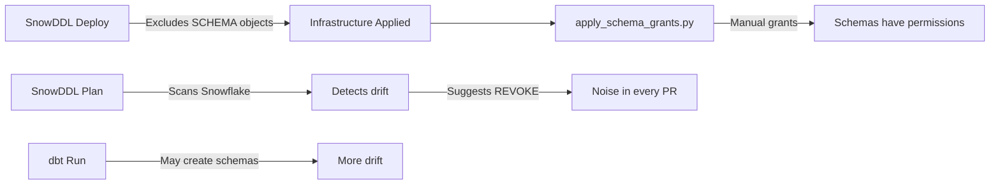
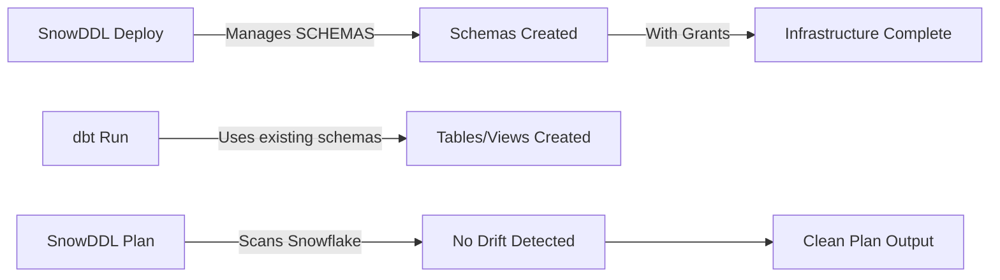

# Schema Drift Elimination Plan

## Executive Summary

**Goal**: Eliminate schema drift warnings by having SnowDDL manage SCHEMA objects directly, while maintaining compatibility with dbt workflows.

**Current Problem**:
- SnowDDL excludes SCHEMA objects (`--exclude-object-types SCHEMA`)
- Schema grants applied via separate `apply_schema_grants.py` script
- SnowDDL sees these grants as "drift" and suggests revoking them
- Creates 15,000+ lines of noise per month that we must manually filter

**Proposed Solution**:
- **Remove** `--exclude-object-types SCHEMA` from SnowDDL configuration
- **Define** all schemas explicitly in SnowDDL YAML files
- **Let** dbt operate on pre-existing schemas instead of creating them
- **Eliminate** the separate `apply_schema_grants.py` script entirely

---

## Current Architecture (Problematic)



**Problems**:
1. Two separate systems managing schema grants (SnowDDL + script)
2. Drift detection noise in every deployment plan
3. Risk of accidentally applying REVOKEs
4. Complex CI/CD with filtering logic
5. Cognitive overhead training developers to ignore warnings

---

## Target Architecture (Clean)



**Benefits**:
1. Single source of truth (SnowDDL YAML)
2. Zero drift warnings
3. No separate grant script needed
4. Simplified CI/CD
5. Clear, actionable plan output

---

## Investigation Phase

### 1. Research SnowDDL SCHEMA Support

**Questions to Answer**:
- How does SnowDDL handle SCHEMA objects when NOT excluded?
- Does SnowDDL support schema-level grants in YAML?
- What happens if a schema exists in Snowflake but not in YAML?
- Does SnowDDL drop unmanaged schemas or just warn?

**Action Items**:
- [ ] Read SnowDDL source code for schema handling
- [ ] Review SnowDDL documentation for schema configuration format
- [ ] Check if SnowDDL supports grants within schema.yaml
- [ ] Determine if SnowDDL has "import existing" functionality

**Resources**:
- SnowDDL GitHub: https://github.com/littleK0i/SnowDDL
- SnowDDL Docs: https://snowddl.readthedocs.io/

### 2. Test in Dev Environment

**Safe Testing Strategy**:
```bash
# Use DEV_ALICE database for testing (isolated from production)
cd snowddl/DEV_ALICE

# Create test schema.yaml
cat > schema.yaml <<EOF
TEST_SCHEMA:
  comment: Testing SnowDDL schema management
  retention_time: 1
EOF

# Run plan WITHOUT schema exclusion (read-only, safe)
uv run snowddl \
  --config-path ./snowddl \
  --env-prefix SNOWFLAKE \
  plan

# Observe output - does it show schema creation? Grants?
```

**What to Validate**:
- [ ] Can SnowDDL create schemas from YAML?
- [ ] Can SnowDDL apply grants on schemas?
- [ ] What happens to existing schemas not in YAML?
- [ ] Are there any errors or warnings?

### 3. Verify dbt Compatibility

**Check dbt Configuration**:
```bash
# Find dbt project (likely in separate repo)
# Look for dbt_project.yml

# Check if dbt has schema creation directives
# Look for: create_schemas, schema: configs
```

**Key Questions**:
- [ ] Does dbt require CREATE SCHEMA privileges?
- [ ] Can dbt work with pre-existing schemas?
- [ ] Does dbt have any logic that depends on creating schemas?
- [ ] Are there any dbt macros that create schemas dynamically?

**Most likely outcome**: dbt can work fine with pre-existing schemas. Standard dbt practice is:
```yaml
# dbt_project.yml
models:
  project_name:
    schema: PROJ_STRIPE  # Uses existing schema, doesn't create
```

---

## Implementation Phase

### 4. Create Missing Schema Definitions

**Current State**:
- ✅ `snowddl/SOURCE_STRIPE/schema.yaml` exists (STRIPE_WHY schema defined)
- ❌ `snowddl/PROJ_STRIPE/schema.yaml` missing (schema created by dbt)
- ❓ Other databases may have missing schema definitions

**Action**: Create schema.yaml files for all databases

```bash
# Create schema.yaml for PROJ_STRIPE
cat > snowddl/PROJ_STRIPE/schema.yaml <<EOF
PROJ_STRIPE:
  comment: dbt-managed Stripe transformation schema - Contains models from dbt_stripe project
  retention_time: 7  # 7 days retention for transformed data
EOF

# Repeat for other databases as needed
# Check all directories in snowddl/ for missing schema.yaml files
```

**Schema Grant Configuration in YAML**:

Research if SnowDDL supports this syntax:
```yaml
STRIPE_WHY:
  comment: Source data schema
  retention_time: 1
  grants:
    USAGE:
      - COMPANY_USERS__B_ROLE
      - STRIPE__T_ROLE
      - DBT_STRIPE_ROLE__T_ROLE
    ALL:
      - DLT_STRIPE_TECH_ROLE__T_ROLE
```

**If SnowDDL doesn't support schema grants in YAML**, investigate:
- Using future grants at database level
- Using tech_role.yaml grants (if it supports schema-level)
- Keeping minimal `apply_schema_grants.py` but no drift

### 5. Update SnowDDL CLI Wrappers

**Files to Modify**:
- `src/snowtower_snowddl/cli.py` (main CLI wrapper)
- `src/snowtower_snowddl/intelligent_apply.py` (intelligent apply logic)

**Changes Required**:

```python
# BEFORE (line 220):
"--exclude-object-types",
"PIPE,STREAM,TASK,SCHEMA",  # ❌ Excluding SCHEMA

# AFTER:
"--exclude-object-types",
"PIPE,STREAM,TASK",  # ✅ No longer excluding SCHEMA
```

**Locations** (from search results):
- `src/snowtower_snowddl/cli.py:220`
- `src/snowtower_snowddl/cli.py:362`
- `src/snowtower_snowddl/cli.py:483`
- `src/snowtower_snowddl/cli.py:567`
- `src/snowtower_snowddl/cli.py:646`
- `src/snowtower_snowddl/cli.py:688`
- `src/snowtower_snowddl/intelligent_apply.py:196`

**Important**: Update ALL occurrences to maintain consistency

### 6. Migration Strategy

**Phase 1: Dev Testing (Week 1)**
- [ ] Create all missing schema.yaml files
- [ ] Remove SCHEMA exclusion in dev environment only
- [ ] Run `uv run snowddl-plan` and review output
- [ ] Test dbt runs against SnowDDL-managed schemas
- [ ] Verify no schema drift warnings

**Phase 2: Staging Validation (Week 2)**
- [ ] Apply changes to staging environment
- [ ] Run full dbt test suite
- [ ] Monitor for 1 week
- [ ] Validate no issues with existing workflows

**Phase 3: Production Rollout (Week 3)**
- [ ] Create detailed rollback plan
- [ ] Schedule maintenance window (low-traffic period)
- [ ] Apply SnowDDL changes to production
- [ ] Monitor for 24 hours
- [ ] Remove `apply_schema_grants.py` from CI/CD
- [ ] Update documentation

---

## Testing & Validation

### 7. Comprehensive Test Plan

**Unit Tests**:
```bash
# Test 1: Verify schema creation
uv run snowddl-plan | grep "CREATE SCHEMA"

# Test 2: Verify schema grants
uv run snowddl-plan | grep "GRANT.*ON SCHEMA"

# Test 3: Verify NO drift warnings
uv run snowddl-plan | grep "REVOKE.*SCHEMA" && echo "FAIL: Still detecting drift" || echo "PASS: No drift"

# Test 4: Apply and verify
uv run snowddl-apply
snowsql -q "SHOW GRANTS ON SCHEMA SOURCE_STRIPE.STRIPE_WHY;"
```

**Integration Tests**:
```bash
# Test 5: dbt can read source data
cd dbt_project
dbt run --select source:stripe_why

# Test 6: dbt can write to transformation schemas
dbt run --select models/stripe/*

# Test 7: End-to-end workflow
uv run snowddl-apply
dbt run --full-refresh
# Verify no errors
```

**Regression Tests**:
```bash
# Test 8: Existing users can still access schemas
# Login as DAVE, ALICE, etc. and verify access

# Test 9: Service accounts still work
# Run GitHub Actions workflow
# Verify dbt service account can access schemas
```

---

## CI/CD Updates

### 8. Update GitHub Actions Workflow

**File**: `.github/workflows/merge-deploy.yml`

**BEFORE**:
```yaml
- name: "Deploy Infrastructure"
  run: |
    uv run snowddl-apply

- name: "Apply Schema Grants (Required)"
  run: |
    uv run apply-schema-grants  # ❌ No longer needed
```

**AFTER**:
```yaml
- name: "Deploy Infrastructure (includes schemas)"
  run: |
    uv run snowddl-apply  # ✅ Now manages schemas directly
```

**Also Remove**:
- Intelligent filtering logic for schema drift
- Pre-deployment schema grant scripts
- Any drift suppression tools

---

## Documentation Updates

### 9. Update Project Documentation

**Files to Update**:
1. ✅ `docs/SCHEMA_GRANTS_CRITICAL.md` - Mark as DEPRECATED or update to reflect new architecture
2. ✅ `docs/SCHEMA_GRANTS_WORKAROUND.md` - Archive or remove
3. ✅ `docs/blog/01_snowddl_schema_crisis.md` - Add epilogue explaining resolution
4. ✅ `docs/blog/narration/01_snowddl_schema_crisis_narration.md` - Update with final solution
5. ✅ `README.md` - Remove references to schema grant workaround
6. ✅ `docs/ARCHITECTURE.md` - Update architecture diagrams

**New Documentation to Create**:
- `docs/SCHEMA_MANAGEMENT.md` - How SnowDDL manages schemas
- `docs/DBT_INTEGRATION.md` - How dbt works with SnowDDL-managed schemas

---

## Rollback Plan

### 10. Emergency Rollback Procedure

**If Production Issues Occur**:

```bash
# Step 1: Revert SnowDDL CLI changes
git revert <commit_hash>
git push

# Step 2: Re-add schema exclusion flag
# Restore --exclude-object-types SCHEMA

# Step 3: Re-apply schema grants
uv run apply-schema-grants

# Step 4: Verify access restored
snowsql -q "SHOW GRANTS ON SCHEMA SOURCE_STRIPE.STRIPE_WHY;"

# Step 5: Communication
# Notify team via Slack/email
# Update incident log
```

**Rollback Decision Criteria**:
- dbt runs failing due to permissions
- Users unable to access schemas
- SnowDDL errors during deployment
- Unexpected schema deletions

**Rollback Window**: 24 hours after production deployment

---

## Success Metrics

**Quantitative Metrics**:
- Schema drift warnings: 15,000/month → 0/month
- PR review time: -50% (no noise to filter)
- Deployment failures: Track before/after
- CI/CD execution time: Should remain similar

**Qualitative Metrics**:
- Developer satisfaction survey
- Code review burden reduction
- Incident rate for permission issues
- Documentation clarity

---

## Risk Assessment

### High Risk
1. **Schema deletion** - If SnowDDL drops unmanaged schemas
   - Mitigation: Test in dev first, create backups
2. **dbt breaking** - If dbt can't work with pre-existing schemas
   - Mitigation: Verify dbt config, test thoroughly

### Medium Risk
1. **Grant configuration** - If SnowDDL doesn't support schema grants
   - Mitigation: Keep minimal grant script as backup
2. **Migration complexity** - Multiple schema.yaml files to create
   - Mitigation: Automate discovery and generation

### Low Risk
1. **Rollback needed** - Well-tested rollback procedure
2. **Documentation drift** - Comprehensive update plan

---

## Open Questions

1. **SnowDDL Schema Grants**: Does SnowDDL support `grants:` block within schema.yaml?
2. **SnowDDL Drop Behavior**: Will SnowDDL attempt to drop schemas not in YAML?
3. **dbt Create Behavior**: Does dbt throw errors if CREATE SCHEMA fails because schema exists?
4. **Future Grants**: Can we use database-level future grants instead of schema-level?

---

## Next Steps

**Immediate (This Week)**:
- [ ] Research SnowDDL source code for schema handling
- [ ] Test schema management in DEV_ALICE database
- [ ] Validate dbt compatibility with existing schemas

**Short-term (Weeks 2-3)**:
- [ ] Create all missing schema.yaml files
- [ ] Implement changes in staging environment
- [ ] Run comprehensive test suite

**Long-term (Week 4+)**:
- [ ] Production rollout with monitoring
- [ ] Remove deprecated scripts and documentation
- [ ] Write blog post: "How We Eliminated 15,000 Lines of Infrastructure Noise"

---

**Last Updated**: 2025-11-22
**Owner**: Database Tycoon Infrastructure Team
**Status**: 🔄 Planning Phase
