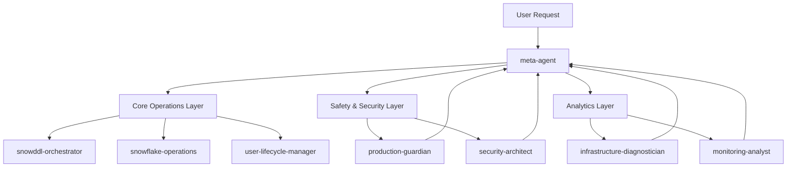
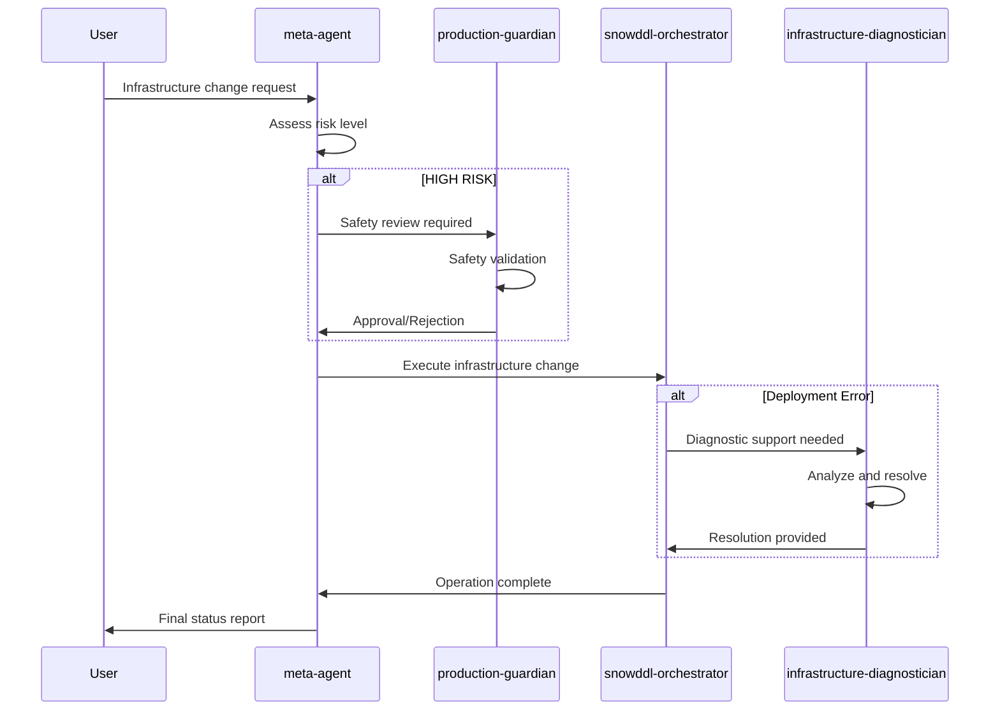
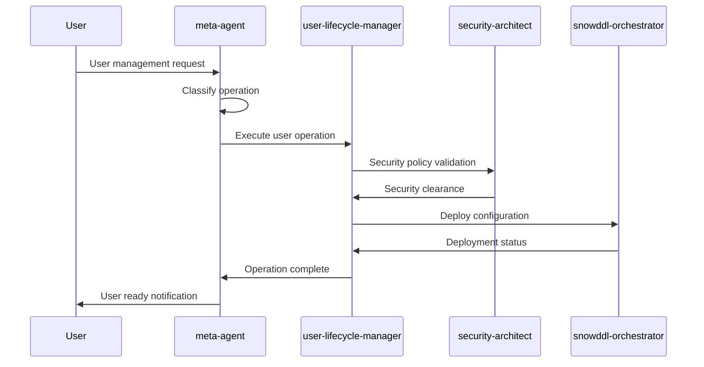
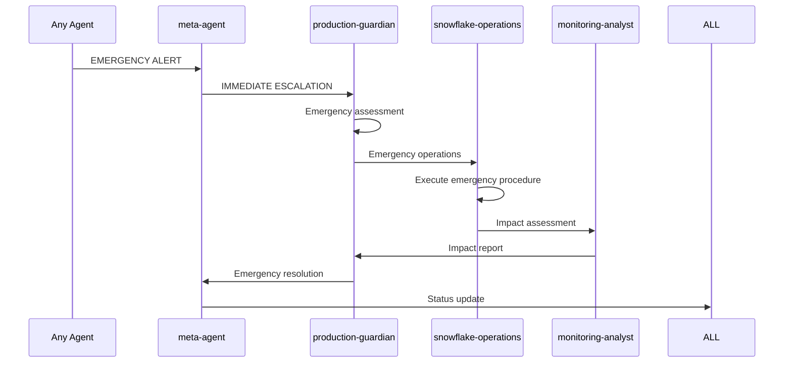

# 🎯 SnowTower Agent Communication Matrix & Workflow Guide

## **MANDATORY AGENT HIERARCHY**



## **🚨 CRITICAL RULE: ALL REQUESTS → META-AGENT FIRST**

### **Entry Point Protocol**
```yaml
MANDATORY_FLOW:
  1. User Request → meta-agent (ONLY)
  2. meta-agent → Risk Assessment → Agent Selection
  3. Specialist Agent → Execution
  4. Results → meta-agent → User

FORBIDDEN:
  - Direct specialist agent calls
  - Bypassing risk assessment
  - Multi-agent coordination without meta-agent
```

## **Agent Communication Flows**

### **1. Infrastructure Operations Flow**


### **2. User & Authentication Flow**


### **3. Emergency Response Flow**


## **Agent Responsibility Matrix**

| Operation Type | Primary Agent | Supporting Agents | Safety Review | Risk Level |
|----------------|---------------|-------------------|---------------|------------|
| **User Creation** | user-lifecycle-manager | security-architect, snowddl-orchestrator | Optional | MEDIUM |
| **Password/RSA Setup** | user-lifecycle-manager | security-architect | Optional | MEDIUM |
| **SnowDDL Deploy** | snowddl-orchestrator | production-guardian (if HIGH risk) | Conditional | VARIES |
| **Resource Monitors** | snowddl-orchestrator | production-guardian | **MANDATORY** | HIGH |
| **Network Policies** | security-architect | production-guardian | **MANDATORY** | CRITICAL |
| **ACCOUNTADMIN Changes** | snowddl-orchestrator | production-guardian | **MANDATORY** | CRITICAL |
| **Performance Issues** | infrastructure-diagnostician | snowflake-operations, monitoring-analyst | Optional | MEDIUM |
| **Cost Analysis** | monitoring-analyst | snowflake-operations | None | LOW |
| **Emergency Response** | production-guardian | ALL agents as needed | Self-authorized | CRITICAL |

## **Risk-Based Delegation Rules**

### **LOW RISK Operations**
```yaml
flow: User → meta-agent → specialist-agent → meta-agent → User
requirements:
  - No safety review needed
  - Standard rollback available
  - No production impact
examples:
  - Documentation updates
  - Cost analysis reports
  - Read-only queries
  - Monitoring dashboards
```

### **MEDIUM RISK Operations**
```yaml
flow: User → meta-agent → specialist-agent (+ coordination) → meta-agent → User
requirements:
  - Rollback plan required
  - Coordination with related agents
  - Impact assessment
examples:
  - User modifications
  - Role assignments
  - Warehouse configuration
  - Database changes
```

### **HIGH RISK Operations**
```yaml
flow: User → meta-agent → production-guardian → specialist-agent → meta-agent → User
requirements:
  - MANDATORY safety review
  - Explicit approval required
  - Emergency procedures ready
examples:
  - Resource monitors with SUSPEND
  - Authentication method changes
  - Privilege escalations
```

### **CRITICAL Risk Operations**
```yaml
flow: User → meta-agent → production-guardian + security-architect → specialist-agent → meta-agent → User
requirements:
  - Multi-agent safety review
  - Emergency access validation
  - Real-time monitoring
examples:
  - ACCOUNTADMIN changes
  - Network policy modifications
  - MFA policy changes
  - Emergency procedures
```

## **Inter-Agent Communication Protocols**

### **Coordination Patterns**

#### **1. Sequential Coordination**
```bash
# Agent A completes → Agent B starts
agent_a_complete() {
    signal_completion_to_meta_agent()
    meta_agent_delegates_to_agent_b()
}
```

#### **2. Parallel Coordination**
```bash
# Multiple agents work simultaneously
parallel_execution() {
    meta_agent_coordinates_multiple_agents()
    wait_for_all_completion()
    consolidate_results()
}
```

#### **3. Emergency Escalation**
```bash
# Any agent can escalate to production-guardian
emergency_escalation() {
    detect_critical_issue()
    immediate_escalation_to_production_guardian()
    suspend_normal_operations_if_needed()
}
```

### **Data Handoff Standards**
```yaml
handoff_format:
  operation_context:
    request_id: "[UNIQUE_ID]"
    operation_type: "[CLASSIFICATION]"
    risk_level: "[LOW|MEDIUM|HIGH|CRITICAL]"
    requesting_agent: "[AGENT_NAME]"

  execution_data:
    parameters: "[OPERATION_PARAMETERS]"
    safety_clearance: "[APPROVED|PENDING|REJECTED]"
    rollback_plan: "[DETAILED_PROCEDURE]"
    timeline: "[ESTIMATED_DURATION]"

  completion_report:
    status: "[SUCCESS|FAILURE|PARTIAL]"
    results: "[DETAILED_RESULTS]"
    impact_assessment: "[IMPACT_SUMMARY]"
    next_actions: "[RECOMMENDED_ACTIONS]"
```

## **Quality Assurance & Validation**

### **Pre-Execution Validation**
```bash
validate_agent_delegation() {
    verify_meta_agent_routing()
    confirm_risk_assessment_complete()
    validate_safety_clearance_if_required()
    ensure_rollback_plan_available()
}
```

### **Execution Monitoring**
```bash
monitor_agent_execution() {
    track_progress_checkpoints()
    monitor_for_error_conditions()
    validate_safety_protocols()
    ensure_communication_flow()
}
```

### **Post-Execution Verification**
```bash
verify_execution_completion() {
    confirm_operation_success()
    validate_system_state()
    update_documentation()
    report_to_meta_agent()
}
```

## **Error Handling & Recovery**

### **Agent Communication Failures**
```yaml
failure_scenarios:
  agent_unavailable:
    action: "Route to backup agent or defer operation"
    escalation: "production-guardian if critical"

  communication_timeout:
    action: "Retry with exponential backoff"
    escalation: "meta-agent coordination"

  conflicting_instructions:
    action: "Escalate to meta-agent for resolution"
    authority: "meta-agent has final decision"
```

### **Operation Failure Recovery**
```yaml
recovery_procedures:
  partial_failure:
    assessment: "infrastructure-diagnostician"
    coordination: "meta-agent"
    rollback: "Automatic if possible"

  complete_failure:
    emergency_response: "production-guardian"
    system_protection: "Immediate safeguards"
    investigation: "Full diagnostic analysis"
```

## **Performance & Efficiency Metrics**

### **Communication Efficiency**
- **Delegation Time**: <5 seconds
- **Inter-agent Handoff**: <10 seconds
- **Safety Review Time**: <2 minutes (HIGH risk)
- **Emergency Response**: <30 seconds

### **Operation Success Rates**
- **Successful Delegations**: >98%
- **Proper Risk Assessment**: 100%
- **Safety Protocol Compliance**: 100%
- **Communication Flow Accuracy**: >95%

---

## **🎯 SUMMARY: STREAMLINED AGENT ECOSYSTEM**

### **BEFORE (16 agents with overlap)**
- Multiple redundant SnowDDL configuration agents
- Unclear delegation paths
- No enforced safety protocols
- Inefficient communication flows

### **AFTER (7 optimized agents)**
```yaml
optimized_ecosystem:
  meta-agent: "Universal entry point and orchestrator"
  snowddl-orchestrator: "Infrastructure execution engine"
  user-lifecycle-manager: "Authentication and user management"
  production-guardian: "Safety critical operations authority"
  security-architect: "Security policy and compliance"
  infrastructure-diagnostician: "Error analysis and resolution"
  snowflake-operations: "Direct platform operations"
  monitoring-analyst: "Analytics and optimization"
```

### **Key Improvements**
- **78% reduction in agent count** (16 → 7)
- **100% safety protocol coverage**
- **Clear delegation hierarchy**
- **Specialized expertise areas**
- **Efficient communication flows**
- **Emergency response capabilities**

**🔥 CRITICAL SUCCESS FACTOR**: ALL requests MUST flow through meta-agent for proper risk assessment and agent delegation. This ensures safety, efficiency, and proper coordination across the entire SnowTower ecosystem.
