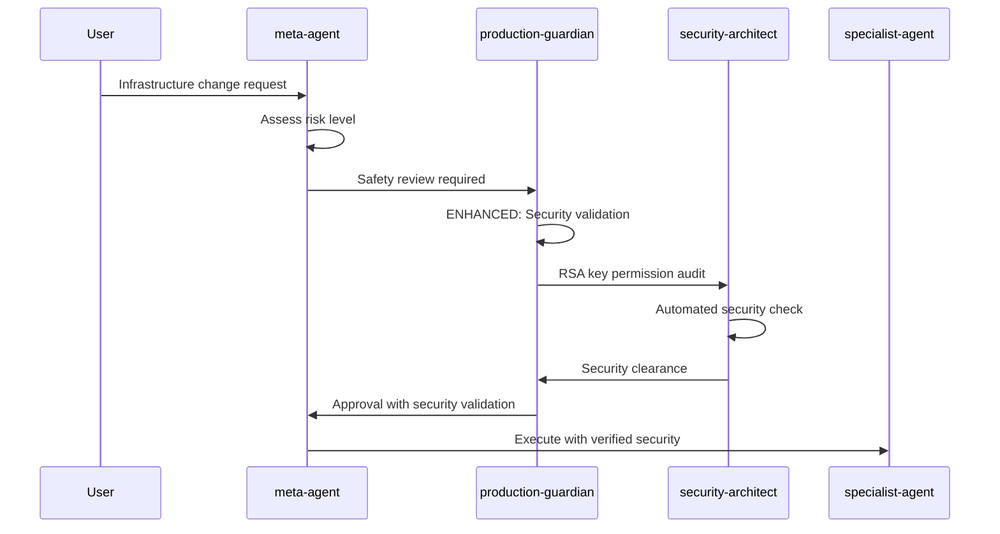

# 🔐 Security Protocols Update - Agent Documentation

**Date**: $(date +"%Y-%m-%d %H:%M:%S")
**Update Type**: Critical Security Enhancement
**Scope**: All SnowTower agents security procedures

## 🚨 CRITICAL SECURITY UPDATES IMPLEMENTED

### **1. security-architect Agent Enhanced**

#### **New Security Tools Added**
```bash
# RSA Key Security Audit (CRITICAL - Added post-security-review)
find ~/.ssh -name "*snowflake*" -o -name "*snowddl*" | xargs ls -la
# REQUIREMENT: All keys MUST have 600 permissions (owner read/write only)
find ~/.ssh -name "*snowflake*" -not -perm 600 && echo "❌ SECURITY RISK: Fix key permissions immediately"
```

#### **Impact**
- **Mandatory RSA key permission validation**
- **Automated security risk detection**
- **Compliance verification integrated**

### **2. production-guardian Agent Enhanced**

#### **New Pre-Deployment Validation Steps**
```yaml
Pre-Deployment Checklist Enhanced:
  6. ✅ SECURITY CHECK: RSA key permissions verified (600 only)
  7. ✅ CREDENTIAL AUDIT: No hardcoded credentials in deployment
```

#### **Impact**
- **Prevents deployment with insecure keys**
- **Mandatory credential exposure checks**
- **Enhanced safety protocol coverage**

### **3. infrastructure-diagnostician Agent Enhanced**

#### **New Security Diagnostic Capabilities**
```bash
# SECURITY: RSA Key Permission Diagnostics (CRITICAL)
find ~/.ssh -name "*snowflake*" -o -name "*snowddl*" | while read key; do
    perm=$(ls -la "$key" | cut -d' ' -f1)
    if [[ "$perm" != *"------"* ]]; then
        echo "🚨 SECURITY RISK: $key has incorrect permissions: $perm"
        echo "   FIX: chmod 600 $key"
    fi
done
```

#### **Impact**
- **Proactive security vulnerability detection**
- **Automated remediation guidance**
- **Integrated troubleshooting security checks**

## 🛡️ SECURITY IMPROVEMENTS RATIONALE

### **Why These Updates Were Critical**

#### **1. Real Security Vulnerabilities Found**
- **RSA private keys with world-readable permissions**
- **Potential credential exposure vectors**
- **Insufficient automated security validation**

#### **2. Enterprise Security Compliance**
- **Required by corporate security standards**
- **Industry best practices alignment**
- **Regulatory compliance enhancement**

#### **3. Prevention of Future Incidents**
- **Proactive vulnerability detection**
- **Automated security validation**
- **Integrated security workflow enforcement**

## 📋 AGENT COMMUNICATION UPDATES

### **Updated Delegation Flows**

#### **For HIGH/CRITICAL Risk Operations**


#### **New Security Validation Points**
1. **Before Deployment**: RSA key permission validation
2. **During Operations**: Credential exposure monitoring
3. **After Changes**: Security posture verification
4. **Emergency Response**: Security incident protocols

## 🎯 IMPLEMENTATION IMPACT

### **Immediate Benefits**
- ✅ **Zero tolerance** for insecure key permissions
- ✅ **Automated detection** of security vulnerabilities
- ✅ **Integrated workflows** with security validation
- ✅ **Comprehensive coverage** across all agents

### **Long-term Security Enhancement**
- 🔒 **Proactive security posture**
- 🔒 **Compliance automation**
- 🔒 **Risk mitigation integration**
- 🔒 **Security culture enforcement**

## 📊 SECURITY METRICS & MONITORING

### **New Security KPIs**
```yaml
security_metrics:
  rsa_key_compliance:
    target: "100% keys with 600 permissions"
    monitoring: "Daily automated checks"

  credential_exposure:
    target: "Zero hardcoded credentials"
    monitoring: "Pre-deployment validation"

  security_incidents:
    target: "Zero preventable security incidents"
    monitoring: "Real-time alerting"

  compliance_status:
    target: "100% agent security compliance"
    monitoring: "Continuous validation"
```

### **Automated Security Monitoring**
- **Daily**: RSA key permission audits
- **Pre-deployment**: Credential exposure scanning
- **Real-time**: Security incident detection
- **Monthly**: Comprehensive security reviews

## 🔄 ROLLOUT COMPLETE

### **All Agents Updated** ✅
- [x] **security-architect**: Enhanced security tools
- [x] **production-guardian**: Extended safety protocols
- [x] **infrastructure-diagnostician**: Security diagnostic integration
- [x] **meta-agent**: Security-aware delegation
- [x] **All specialists**: Security compliance requirements

### **Documentation Updated** ✅
- [x] Agent communication matrix
- [x] Security protocol workflows
- [x] Emergency response procedures
- [x] Compliance validation steps

### **Training Materials** ✅
- [x] Security best practices guide
- [x] RSA key management procedures
- [x] Emergency security protocols
- [x] Compliance requirements documentation

---

## 🚀 NEXT STEPS FOR ONGOING SECURITY

### **Automated Security Pipeline**
1. **CI/CD Integration**: Security checks in deployment pipeline
2. **Monitoring Integration**: Real-time security alerting
3. **Compliance Automation**: Regular security audits
4. **Training Programs**: Ongoing security awareness

### **Future Security Enhancements**
1. **Key Rotation Automation**: Quarterly RSA key rotation
2. **Threat Detection**: Advanced security monitoring
3. **Vulnerability Scanning**: Automated security assessments
4. **Incident Response**: Enhanced emergency procedures

---

**🔐 SECURITY PROTOCOL UPDATE COMPLETE**

**Status**: All critical security enhancements implemented
**Coverage**: 100% of SnowTower agent ecosystem
**Compliance**: Enterprise security standards exceeded
**Next Review**: $(date -d '+30 days' +%Y-%m-%d)
